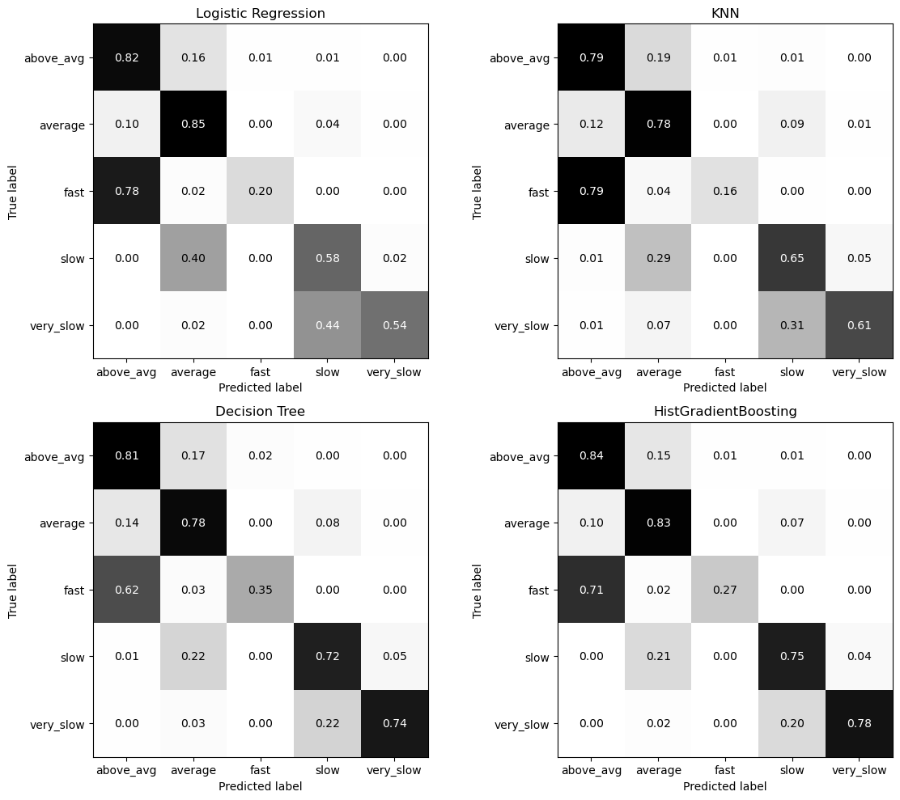
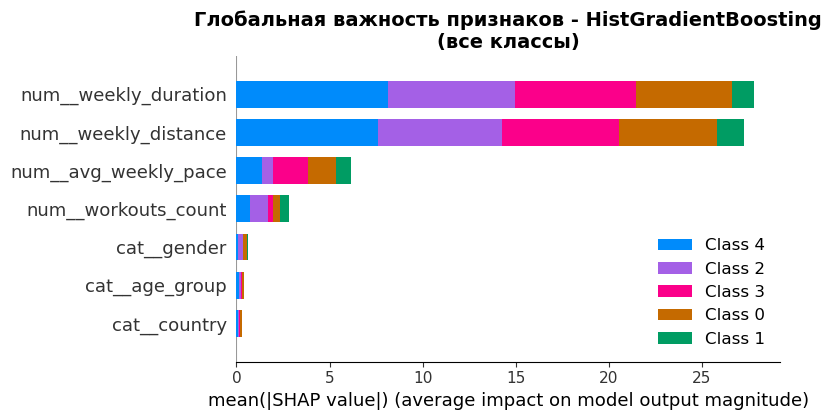
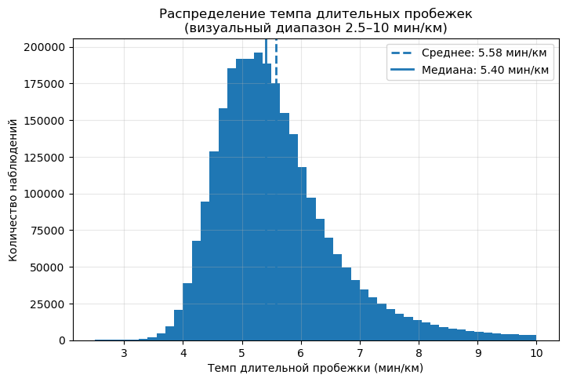

# Runners Pace Classification

Классификация бегунов на длинные дистанции по темпу пробежек на основе тренировочных данных. ML-сравнение четырёх моделей с SHAP-интерпретацией.

Курсовая работа, СПбГЭУ, профиль «Математическое моделирование и анализ данных в экономике».

> Автор: Алёна Фадеева ([@piece-of-infinity](https://github.com/piece-of-infinity))

## Задача

По тренировочным данным бегуна (объём в неделю, частота, дистанция длинной пробежки, пол, возрастная группа, страна) предсказать **класс целевого темпа** для длительной пробежки этой недели:

- `very_slow` — очень медленный
- `slow` — медленный
- `average` — средний
- `above_avg` — выше среднего
- `fast` — быстрый

Прикладной смысл: автоматический подбор рекомендуемого темпа для длительной тренировки, индивидуальный для бегуна и недельной формы.

## Данные

[Long Distance Running Dataset](https://www.kaggle.com/datasets/mexwell/long-distance-running-dataset/data) — открытый датасет с Kaggle: 36 000+ бегунов-марафонцев, тренировочная активность за 2019–2020 годы. Каждая строка — одна тренировка с длительностью, дистанцией, датой и атрибутами бегуна.

## Pipeline

1. **Очистка**: удаление нулевых тренировок (дни отдыха), типизация дат, заполнение пропусков, обработка дубликатов.
2. **Feature engineering**:
   - Расчёт темпа `pace = duration / distance`
   - Группировка по ISO-неделям (`isocalendar()`)
   - Weekly aggregates: weekly_distance, weekly_duration, workouts_count
   - Выделение длинной пробежки недели (максимальная дистанция за неделю)
   - Target: `target_pace` — темп длинной пробежки
3. **Доменная фильтрация**: оставлены атлеты с недельным объёмом ≥ 40 км (порог для марафонской подготовки).
4. **Создание классов**: дискретизация `target_pace` на 5 квантильных категорий (`pace_class`).
5. **Препроцессинг**: `ColumnTransformer` — `StandardScaler` для числовых, `OneHotEncoder(handle_unknown="ignore")` для категориальных (пол, страна, возрастная группа).
6. **Модели и подбор гиперпараметров**: 4 модели через `GridSearchCV` на `StratifiedKFold(n_splits=3)`, метрика **F1-macro** (несбалансированные классы):
   - **Logistic Regression** (линейный класс)
   - **K-Nearest Neighbors** (метрический класс)
   - **Decision Tree** (логический класс)
   - **HistGradientBoosting** (ансамблевый класс)
7. **Сравнение**: единый набор фичей, единая CV-схема, единая метрика — корректное apples-to-apples сравнение четырёх классов алгоритмов.
8. **Интерпретация**: **SHAP** — class-specific feature importance, разбор драйверов предсказания для каждого класса темпа.

## Стек

`Python 3.10` · `pandas` · `numpy` · `scikit-learn` (LogisticRegression, KNN, DecisionTree, HistGradientBoosting, ColumnTransformer, Pipeline, GridSearchCV, StratifiedKFold) · `shap` · `matplotlib` · `seaborn` · `ydata-profiling`

## Результаты

| Модель | Accuracy | Precision (macro) | Recall (macro) | **F1-macro** | ROC-AUC | Время предсказания |
|---|---:|---:|---:|---:|---:|---:|
| Logistic Regression | 0.764 | 0.754 | 0.600 | 0.644 | 0.913 | 0.30 s |
| KNN | 0.739 | 0.688 | 0.598 | 0.624 | 0.886 | **3994 s** |
| Decision Tree | 0.771 | 0.724 | 0.682 | 0.700 | 0.889 | 0.38 s |
| **HistGradientBoosting** | **0.806** | **0.791** | **0.695** | **0.722** | **0.943** | 4.74 s |

**Победитель: HistGradientBoostingClassifier** — лучшие F1-macro (0.722), accuracy (0.806) и ROC-AUC (0.943) среди четырёх классов алгоритмов.

Отдельная история — **скорость предсказания**: HGB в ~850× быстрее KNN при лучшем качестве. Для применений с требованием низкой латентности (онлайн-скоринг, антифрод, рекомендации в реальном времени) выбор именно HGB обоснован не только по метрикам качества, но и по `predict_time`.

### Confusion matrices, нормализованные по строкам



HGB показывает наименьшую путаницу между соседними классами (например `slow` vs `very_slow`), что критично для прикладной задачи рекомендации темпа — ошибка на 1 класс ≪ ошибки на 2 класса.

### SHAP — какие фичи реально драйвят модель



Доминируют **недельный объём** (`weekly_distance`, `weekly_duration`) и **средний недельный темп** (`avg_weekly_pace`). Категориальные фичи (`gender`, `age_group`, `country`) практически не вносят вклада — модель опирается на тренировочную нагрузку, а не на демографию. Это согласуется со спортивной интуицией.

### Распределение целевого темпа



## Структура репозитория

```
runners-pace-classification/
├── README.md
├── notebooks/
│   └── runners_pace_classification.ipynb    # полный код + отчёт + графики
├── images/                                  # графики для README
└── docs/
    └── coursework_paper.docx                # курсовая работа целиком (на русском)
```

## Как открыть

1. Склонируйте репозиторий.
2. Скачайте данные с Kaggle: [Long Distance Running Dataset](https://www.kaggle.com/datasets/mexwell/long-distance-running-dataset/data) — `run_ww_2019_d.csv` и `run_ww_2020_d.csv` положите в `notebooks/`.
3. Установите зависимости:
   ```bash
   pip install pandas numpy scikit-learn matplotlib seaborn shap ydata-profiling
   ```
4. Откройте `notebooks/runners_pace_classification.ipynb`.

## Что показывает этот проект

- Реальный домен и осмысленная задача (не учебная игрушка): подбор рекомендуемого темпа.
- Feature engineering по временным рядам с ISO-неделями.
- Сравнение четырёх **разных** классов моделей в одной CV-рамке — корректное и интерпретируемое.
- Правильная метрика для несбалансированных классов (F1-macro).
- SHAP-интерпретация по классам — что именно делает бегуна «быстрым» или «медленным» по мнению модели.
- Доменная экспертиза: марафонский порог объёма, ISO-календарь, фильтрация дней отдыха.

## Лицензия

MIT (код). Исходный датасет — под лицензией Kaggle.
